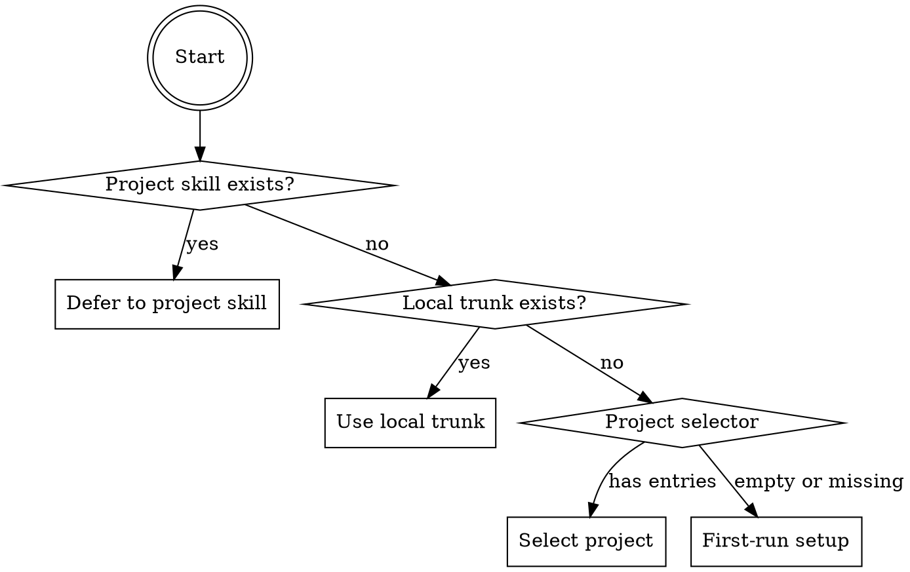

# Session On Hand

**Architecture reference**: For sigma trunk layer schemas, size constraints, ID rules, and the consolidation protocol, see the plugin documentation.

## Instance Primer

You are running `/buffer-on`. Reconstruct context from the sigma trunk so you can
work effectively without the user re-explaining everything.

The sigma trunk has three layers: Hot (~200 lines, always loaded), Warm (~500 lines,
selectively loaded via pointers), Cold (~500 lines, on-demand only). Load the minimum
needed to orient.

**Key principles**:
- Load the minimum needed to orient. Hot always, warm selectively, cold rarely.
- **Verify against git state.** The sigma trunk records a commit hash. If commits
  happened outside a session, flag the discrepancy — the trunk may be stale.
- Instance notes are the previous instance's honest observations. Read them carefully.
- After reconstruction, **arm autosave**.
- If a project skill exists, it adds project-specific priorities on top.

**What you produce**: A reconstructed context in your working memory, an armed autosave, and a clear presentation to the user of where things stand and what comes next.

## Script Tooling

**`scripts/buffer_manager.py`** (plugin-relative) handles mechanical sigma trunk operations. Use it instead of manually parsing JSON.

| Command | Replaces | What it does |
|---|---|---|
| `read --buffer-dir .claude/buffer/` | Steps 1, 3, 4 | Parse hot layer, resolve warm pointers (including `see` refs, tombstones, redirects), output formatted reconstruction |
| `validate --buffer-dir .claude/buffer/` | (diagnostic) | Check layer sizes, schema version, required fields |
| `next-id --buffer-dir .claude/buffer/ --layer warm` | (utility) | Get next sequential ID (`w:N`, `c:N`, or `cw:N`) |

**Usage**: `python <plugin-path>/scripts/buffer_manager.py <command> [options]`

Add `--warm-max N` if the project overrides the default warm layer max (500 lines).

The `read` command outputs a complete formatted reconstruction covering session state, orientation, open threads, decisions, instance notes, concept map digest, convergence web digest, resolved warm pointers, and layer size warnings. **Steps 2 (git grounding), 5 (full-scan check), 6 (instance notes presentation), 7 (MEMORY.md), and 8 (autosave arming) still need manual handling.**

---

## Step 0: Project Routing



### 0a: Check for project skill

1. Determine the current repository root (via `git rev-parse --show-toplevel` or working directory)
2. Check if `<repo>/.claude/skills/buffer/on.md` exists
3. **If it exists**: read that file and follow its instructions instead. Stop processing this file.
4. **If not**: continue below.

### 0b: Check for local sigma trunk

Check if `<repo>/.claude/buffer/handoff.json` exists.

- **If it exists**: use it. Proceed to Step 1.
- **If not**: continue to 0c.

### 0c: Project selector

Read `~/.claude/buffer/projects.json`. Present options via AskUserQuestion popup
based on registry state:

**One project registered:**
- Resume [project name] (last handoff: [date])
- Start new project
- Start lite session

**Multiple projects registered:**
- Resume [most recent project] (last handoff: [date])
- Switch project (shows full list with dates and one-line context)
- Start new project
- Start lite session

**No projects registered:**
- Start new project
- Start lite session

"Most recent" = highest last_handoff date in the registry.

If user selects an existing project: load its buffer_path and proceed to Step 1.
If user selects "Start new project" or "Start lite session": proceed to 0d.

### 0d: First-run setup

No sigma trunk found anywhere. Initialize a new project:

1. Popup: "Buffer scope?" — Full / Lite
   - Full — Concept maps, convergence webs, conservation, tower archival.
     For research projects, multi-source analysis, deep domain work.
   - Lite — Decisions and threads only. For everyday development,
     quick projects, session continuity without research infrastructure.
2. Popup (Full only): Project name + one-sentence core insight
3. Popup: "Remote backup?" (see buffer-off first-run flow)
4. Initialize `.claude/buffer/` with scope-appropriate schemas:
   - **Lite**: `buffer_mode`, `session_meta`, `active_work`, `open_threads`, `recent_decisions`, `instance_notes`, `natural_summary`
   - **Full**: Full schema including `concept_map_digest`
5. Register in global project registry (see Step 0e)
6. Configure MEMORY.md integration (see Step 0f)
7. Confirm: "Sigma trunk initialized in [scope] mode. Ready to go."
8. Arm autosave (see Autosave Protocol below)
9. **Stop here** — no previous state to reconstruct. Wait for user direction.

### 0e: Register in global project registry

Read (or create) `~/.claude/buffer/projects.json`:

```json
{
  "schema_version": 1,
  "projects": {
    "[project-name]": {
      "buffer_path": "[absolute path to .claude/buffer/]",
      "last_handoff": "YYYY-MM-DD",
      "project_context": "[one-sentence description]"
    }
  }
}
```

Add the current project if not already registered. Write back.

### 0f: MEMORY.md integration (first-run only)

After registering the project, configure how MEMORY.md and the sigma trunk coexist. This runs **once** during first-run setup.

1. Locate MEMORY.md (check repo root, `.claude/`, `~/.claude/projects/*/memory/`)

2. **If MEMORY.md exists**, present the user with two options:

   ```
   I found a MEMORY.md file. The sigma trunk works best as the single source
   of truth for theoretical content and session state. How should I handle MEMORY.md?

   1. Full integration — Restructure MEMORY.md into a lean orientation card
      (~50-60 lines): project location, architecture, parameters, preferences,
      and a pointer to the sigma trunk. Theoretical definitions and source mappings
      migrate to the trunk's concept_map. No content is lost.

   2. No integration — Leave MEMORY.md as-is. The sigma trunk operates
      independently. Duplicate content may load in /buffer-on sessions.
   ```

3. Record the choice in the hot layer:
   ```json
   "memory_config": {
     "integration": "full" | "none",
     "path": "[resolved MEMORY.md path]"
   }
   ```

4. **If full integration**:
   - Read MEMORY.md completely
   - **Keep in MEMORY.md**: project location, architecture, key parameters, user preferences, completed stages (compress to one line per stage)
   - **Migrate to sigma trunk**: theoretical concept definitions to warm `concept_map` entries (new `w:N` IDs), philosophical reference summaries to `concept_map` cross_source entries, forward note details to `open_threads` or warm entries with `ref` fields, current status/next action to `active_work` (already in hot)
   - Rewrite MEMORY.md in orientation card format:
     - Keep sections listed above
     - Add `## Status` one-liner: `**Status**: [current_phase]. Next: [next_action].`
     - Add `## Sigma Trunk Integration` pointer:
       ```
       Theoretical framework, cross-source mappings, and session state live in
       `.claude/buffer/`. Run `/buffer-on` for full working context. This file is the
       orientation card — enough for standalone sessions, no duplication with the trunk.
       ```
   - Update `concept_map_digest` in hot to reflect any migrated entries

5. **If no integration**: skip.

6. **If MEMORY.md does not exist**: create a minimal orientation card with project location (from git/cwd) and a sigma trunk pointer. Set `memory_config.integration` to `"full"`.

---

## Standard On-Hand Process

Run these steps when a sigma trunk was found (Steps 0a-0c succeeded).

### Step 1: Read hot layer only

Read `.claude/buffer/handoff.json` (~200 lines). This is the only mandatory read at startup.

- If `schema_version` is missing or < 2, inform the user: "Found v1 sigma trunk. Run `/buffer-off` first to migrate to v2 format."

### Step 2: Git grounding

Ground the session in actual repo state:

```bash
git log --oneline <session_meta.commit>..HEAD   # commits since last handoff
git status                                       # current working tree
git diff --stat                                  # uncommitted changes
```

Present the results:
```
## Repo state
**Sigma trunk recorded**: [commit] on [branch] ([date])
**Current HEAD**: [commit] on [branch]
**Commits since handoff**: [count] — [one-line summaries if any]
**Working tree**: [clean / N modified files]
```

If there are commits or changes not recorded in the sigma trunk, flag them — the trunk may be stale.

### Step 3: Present session state

> In lite mode, present only `natural_summary` and skip the structured fields below. Full mode presents the full session state.

From the hot layer only:

```
## Last Session: [date]
**Commit**: [hash] on [branch]
**Phase**: [current_phase]
**Completed**: [list]
**In Progress**: [item or "nothing pending"]
**Next Action**: [next_action]

## Natural Summary
[natural_summary text]
```

### Step 4: Follow flagged pointers

> **Mode gate: Full only.** Lite mode has no concept map — skip this step.

Selective loading from warm/cold layers using the pointer-index system:

**For each entry in `concept_map_digest.flagged` and `concept_map_digest.recent_changes`:**

1. Collect all referenced IDs from `"see"` arrays (these will be `w:N` warm-layer IDs)
2. Read `handoff-warm.json` and extract ONLY the entries matching those IDs
3. If a warm entry has `"see_also"` references, read `handoff-cold.json` and extract those entries
4. **Max cascade depth: 3** (hot -> warm -> cold, then stop)
5. **Visited set**: track all followed IDs to prevent circular references
6. **Broken ref**: if an ID is not found in the target file, log `"Broken reference: [id] not found in [layer]"` and continue
7. **Tombstone**: if an entry has `"archived_to"`, note: `"[id] was archived to [tower file]. Ask user if retrieval is needed."`
8. **Redirect tombstone**: if an entry has `"migrated_to"`, follow the redirect to the indicated layer and load the target entry

**For each `open_thread` with `"see"` pointers:**
- Follow into warm layer, present relevant context

Present flagged/changed concepts:
```
## Concept Map Changes
- [NEW] [summary] (see w:N)
- [CHANGED] [summary] (see w:N)
- [NEEDS_USER_INPUT] [summary] (see w:N)
```

### Step 5: Check full-scan threshold

> **Mode gate: Full only.** Lite mode skips this step.

If `sessions_since_full_scan >= full_scan_threshold`:

```
It's been [N] sessions since a full sigma trunk scan (threshold: [T]).
Would you like me to do a complete review of warm + cold layers?
```

- If yes: read all layers, surface stale/orphaned entries, reset `sessions_since_full_scan` to 0 in the hot layer
- If no: continue with selective loading

**Promotion check** (only during full scan, only if `memory_config.integration` is `"full"`):

After the full scan completes, identify warm-layer entries that:
1. Have not changed in the last `full_scan_threshold` sessions (stable)
2. Were pointer-loaded in 3+ consecutive sessions (frequently referenced)

If any qualify, present to the user:
```
These sigma trunk entries are stable and loaded nearly every session.
Promoting them to MEMORY.md makes them available without /buffer-on:
- [concept] (unchanged N sessions, loaded M times)

Promote to MEMORY.md's Stable Definitions section? (max 10 lines per cycle)
```

If approved:
- Add/update a `## Stable Definitions` section in MEMORY.md (before `## Sigma Trunk Integration`)
- Each promoted entry: one-line definition
- Cap: 10 lines promoted per cycle
- The warm entry remains the source of truth — MEMORY.md gets a read-only copy
- Mark warm entry: `"promoted_to_memory": "YYYY-MM-DD"`
- `/buffer-off`'s MEMORY.md sync step keeps promoted copies current

If declined or no candidates: continue.

### Step 6: Surface instance notes

> In lite mode, instance notes are still present — surface them if they exist.

If the hot layer has an `instance_notes` section, present it:

```
## Notes from the previous instance
[remarks — paraphrased naturally, not as a JSON dump]

**Open questions:**
- [question 1]
- [question 2]
```

These questions are worth surfacing — the user may want to address them.

### Step 7: Read MEMORY.md

Read the project memory file for baseline context. The sigma trunk is the session alpha stash; MEMORY.md is the project baseline.

If the memory file path is not specified in a project skill, look for:
- `MEMORY.md` in the repo root
- `.claude/MEMORY.md`
- `~/.claude/projects/*/memory/MEMORY.md`

### Step 8: Arm autosave and confirm

Tell the user:

```
Context reconstructed from [date] handoff. Ready to continue from [current_phase].
Autosave armed — sigma trunk will stay current throughout the session.
```

Ask: "Shall I proceed with [next_action or first open_thread], or do you have a different priority?"

---

## Autosave Protocol

Armed automatically when on-hand completes (Step 8). The instance fires autosaves silently at natural completion boundaries. **The user does not trigger these — they are automatic.**

### When to fire

- After a distillation pipeline completes (all post-distillation updates done)
- After a test suite passes following an implementation phase
- After a significant discussion produces a named decision
- When the user shifts to a different topic or task
- Before the context window is critically full (self-preservation)

### What to write (lightweight — NOT a full handoff)

Update the hot layer (`handoff.json`) only:

1. `session_meta.date` — current date
2. `session_meta.commit` — current HEAD
3. `active_work` — current phase, completed items, in-progress, next action
4. `recent_decisions` — append new decisions since last autosave
5. `open_threads` — update statuses (resolved, new threads)
6. `concept_map_digest` — update if concept map changed this autosave interval
7. `natural_summary` — one-sentence update appended: "[autosave] [brief note]"

Write ONLY `handoff.json`. Do not touch warm or cold layers.

**Mode-specific autosave:**
- **Lite**: Write `session_meta`, `active_work`, `open_threads`, `recent_decisions`, `instance_notes`, `natural_summary`. Skip `concept_map_digest`.
- **Full**: All fields including `concept_map_digest`.

### What to skip (reserved for full /buffer-off)

- Instance notes (these are end-of-session reflections)
- Full natural summary regeneration
- Warm/cold layer writes
- Git commit (autosaves are sigma trunk saves, not commit-worthy)

### Overflow guardrail

Before writing, check whether the updated hot layer exceeds 200 lines. If it does:

1. **Do NOT silently migrate** — autosave cannot push content to warm/cold on its own
2. **Prompt the user**:
   ```
   Hot layer is at [N] lines (limit: 200). Autosave can't write without
   pushing older entries to warm. Options:
   - Run `/buffer-off` now (full conservation with your input)
   - Let me trim this save to essentials only (skip older decisions/threads)
   - Skip this autosave (sigma trunk stays at last state)
   ```
3. Wait for user choice before proceeding

The same principle applies transitively: if a full `/buffer-off` would cascade warm to cold or cold to archival, those operations already require user input (the archival questionnaire in `/buffer-off` Step 9). Autosave simply refuses to start that cascade silently.

**Rule:** Autosave can *update* hot. Autosave cannot *overflow* hot. Overflow = user decision.

### How to fire

- **Silently** — no announcement unless the user has asked about sigma trunk state
- On success with no overflow, emit exactly: `(autosaved)` — nothing else, no elaboration
- If overflow detected, prompt the user (see guardrail above)
- If it fails (permission error, path issue), warn the user

### Post-Compaction Consistency Check

When context compaction occurs (the system injects a summary of earlier conversation), the instance has lost detailed dialogue context but retains the compaction summary and full access to sigma trunk files on disk.

**Hook-assisted activation**: If the project has compaction hooks configured, the hooks handle this automatically:

1. **PreCompact hook** fires *before* compaction — autosaves the hot layer with current commit hash and `[compacted]` marker
2. **SessionStart:compact hook** fires *after* compaction — injects a concise sigma trunk reconstruction (session state, orientation, threads, decisions, instance notes, layer sizes) as `additionalContext`, plus a directive to run the consistency check below

The post-compaction instance receives the sigma trunk context in a system-reminder and should see the "REQUIRED: Post-Compaction Consistency Check" directive. If hooks are NOT configured, this check is still **self-activating**: it fires whenever compaction is detected AND sigma trunk files exist on disk, regardless of whether `/buffer-on` was run or autosave was explicitly armed.

**Immediately after detecting compaction (whether via hook or self-detection), before resuming any other work:**

1. Read `handoff.json` (hot layer) — or use the hook-injected summary if available
2. Compare `active_work` and `open_threads` against the compaction summary:
   - Is `current_phase` still accurate?
   - Does `completed_this_session` reflect what the summary says was done?
   - Are `open_threads` statuses consistent with the summary?
   - Does `next_action` still make sense given what was discussed?
3. If any mismatches: update the hot layer in place (same write rules as autosave — hot only)
4. Verify `natural_summary` has `[compacted]` marker (the PreCompact hook adds this; if missing, append `"[compacted] Context compacted mid-session."`)
5. **Do NOT attempt warm-layer review** — the instance no longer has the full dialogue context that informed those entries. Warm-layer work with partial context risks losing distinctions the instance no longer remembers were important.
6. Arm autosave
7. Resume the user's work

**Principle**: Be transparent about operating on a summary. A post-compaction instance should treat inherited warm entries with the same caution as an inherited-entry review — propose changes to the user, don't auto-modify.

This check is lightweight (read hot, compare, fix mismatches) and honest about its limitations. It catches gross mismatches without pretending the instance still has full context.

**Hook setup**: The session-buffer plugin configures compact hooks automatically via
hooks/hooks.json. No manual configuration needed. If using the sigma trunk system without
the plugin, configure PreCompact (manual + auto matchers) and SessionStart hooks
pointing to compact_hook.py.

### Autosave vs Handoff vs Post-Compaction

| | Autosave | `/buffer-off` | Post-Compaction |
|---|---|---|---|
| **Trigger** | Automatic, at completion boundaries | Manual (`/buffer-off`) or end-of-session | Automatic, on compaction detection |
| **Scope** | Hot layer only | All layers (hot + warm + cold) | Hot layer only (consistency check) |
| **Conservation** | None — prompts user if overflow detected | Full migration + size enforcement | None |
| **Instance notes** | None | Written fresh | None |
| **Git commit** | No | Yes | No |
| **Warm-layer work** | No | Yes (consolidation) | **No** — insufficient context |
| **User interaction** | Only on overflow | Confirms completion | None (silent) |
